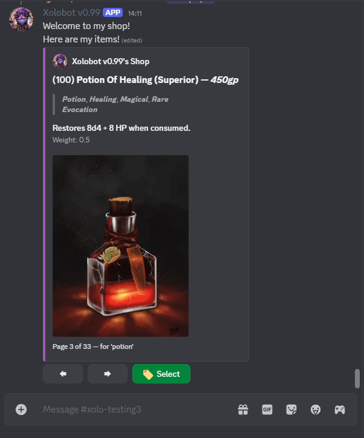
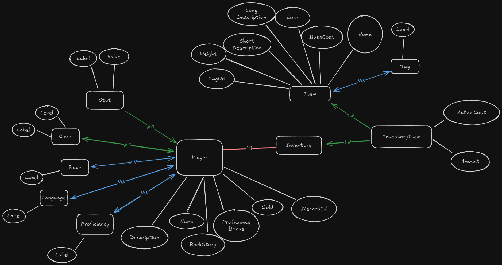

Discord DND bot for managing player inventories and handling shop interactions. The goal is to make the features easy to use and visually straight forward through discords primitive UI features, only using typed commands when necessary.

Old revitalized hackathon project.

Most the direct DB interaction is or started as AI-gen because I value the health of my fingers and couldnt be bothered to manually convert from mongo to sql.

# How to Run:

Create `appsettings.json` in `./DiscordBot` and give it the proper keys
```json
{
  "Secrets": {
    "OpenAI": "",
    "Discord": ""
  },
  "System-prompt": "You are xolobot"
}
```

Have `database.db` either in `./DiscordBot` or located properly so it can be acessed with `./DiscordBot`


---

Places to expand in the future:
- [ ] Trade/give
- [ ] Xolobob error messages
- [ ] better/more admin functionality
    - [ ] If you are able to ever see the inv of another player, then you should be able to sell the item FOR them
- [ ] price changing when buying/selling (this requires making the item value unknown until attempting to sell, to get around issues, and to keep items as a single ItemStack and not differing ones based on bought value)
- [ ] pay
- [ ] Better strings
- [ ] Haggle
- [ ] Display item publicly from your inv
- [ ] Lore module
- [ ] Allow bot to work in dms
- [ ] Redo some things with mobile use as the main focus.
- [ ] Smart AI integration
    - [ ] Use AI to make custom messages
    - [ ] Trigger commands through inferencing the intent in @ messages towards the bot
- [ ] Optimizations
    - [ ] caching system for db
    - [ ] Find a way to deal with message clutter
        - [ ] Merge and unify functionality of sub/main, or make the sub menu edit the main instead of being a response
    - [ ] Do I really need the selector menu ID, when I only use the selector-selector id(items)
    - [ ] I can probably make more efficient db calls for my existing classes instead of always creating the PlayerProfile DSO
    - [ ] dysnc issue after 3 seconds (a bug which happens when using vpn)
    - [ ] A way to making adding items to the DB easier (either in app, or a separate DB app).


---


# Demos

## Shop open


## Selecting an item


### Skip the shop menu

It is slow to navigate the items in the shop one by one. Using this opens a dropdown for faster navigation. In the future the normal view will either be merged with this or removed entirely for this. 


## Player Data

Inventory can either be displayed as a basic text list or as the same view from the shop---giving the option to either sell the item, or delete the item (ex: you used a potion, so you must delete it from your inventory later.)

Inventories are private and can only been seen by the correct player; users with server admin can look and sell from any inventory.


# DB Diagram

